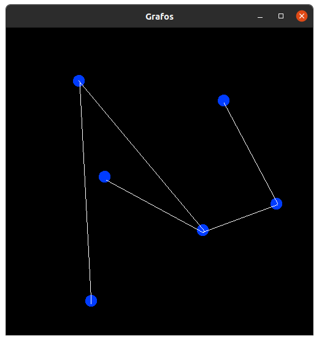
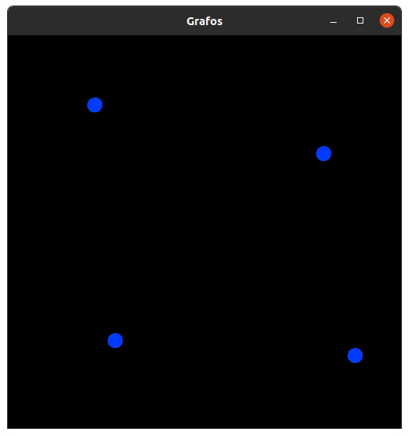
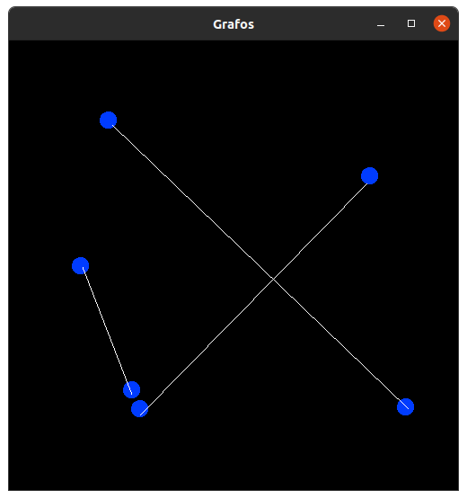

# sfml_test
Pruebas de la libreria SFML en c++

## Librerias Requiridas:
* SFML

## Instrucciones de compilacion

### Instalar la libreria:
Para correr el programa se necesita la siguente libreria:
```
libsfml-dev
```
Se puede instalar con el manejador de paquetes preferido: eg 
```
sudo apt install libsfml-dev
```

### Compilacion

Para compilar el programa, se puede correr el `makefile` incluido, para eso, solo hay que poner en una terminal

```
makefile
```
Y automaticamente generara el binario

### A Mano:
Si no se desea usar el makefile, se puede hacer de la siguente manera
```
g++ -c sprite_test.cpp

g++ sprite_test.o -o sfml-app.o -lsfml-graphics -lsfml-window -lsfml-system
```

### Ejecucion
Para ejecutar el programa, hay que poner en una terminal el siguente comando:
```
./sfml-app.o
```

## Funcionalidades
El programa tiene por ahora, tres funcionalidades basicas:
* Añadir un nodo  -> dando click
* Unir dos nodos -> dando click a dos nodos
* Mover los nodos -> presionando la rueda del mouse sobre el nodo y mover el mouse sin soltarlo

## Programa

El programa se ve asi:




